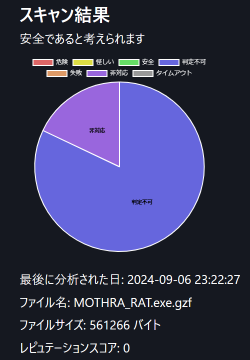
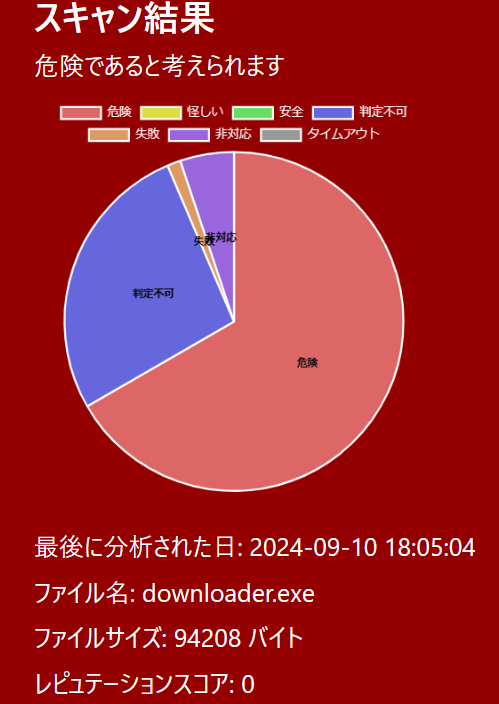
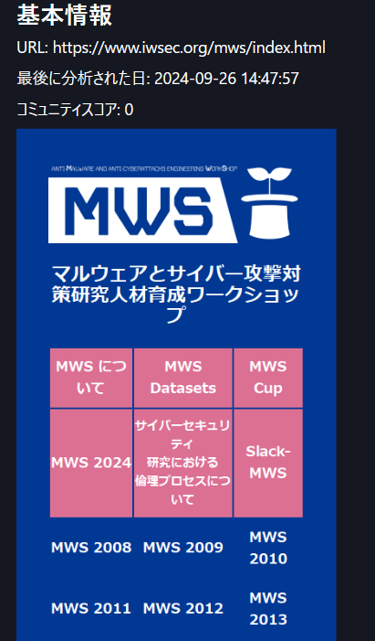
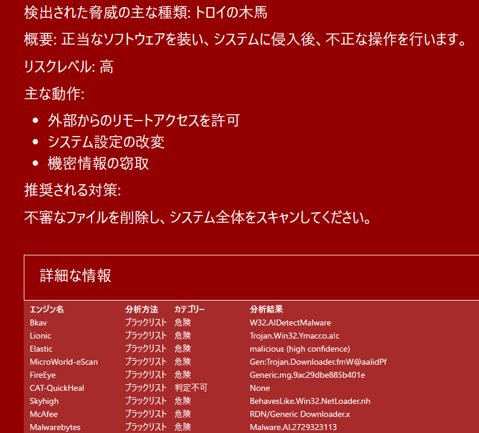

# MWS Cup 2024 事前課題 Team BirdStone

## 提出課題
**セキュアチェッカー**

## メンバー
- 重田歩久翔 
- 濱口翔馬
- 福田光琉
- 和田吉史
- 曽根悠真
- 藪田悠生

所属 : 大阪工業大学情報科学部

## セキュアチェッカーとは
- 初心者でもセキュリティ脅威を容易に理解できるようなツール
- VirusTotalのAPIを用いて作成
- 危険度に応じた表示、URLを開いた際のスクリーンショットの表示、検出された脅威に関する情報や対策の表示、日本語対応を実装  


1. 安全な場合  


2. 危険な場合  


3. スクリーンショットの表示  


4. 脅威に関する情報や対策の表示  



## 使用方法
1. [VirusTotal](https://www.virustotal.com/gui/home/upload)のAPIを取得する

2. ソースコードを取得します
```
git clone https://github.com/shigeta-oit/MWS2024_Secure-Checker
```

3. API KEYをapi.txtに貼り付ける

    1行目　`xxxxxxxxxxxxxxxxxxxxxxxxxxxxxxxxxxxxxxxxxxxxxxxxxxxxxxxxxxxx`


4. app.pyを実行し、ローカルサーバを起動  
※requirements.txtに記載しているPythonの外部ライブラリをインストールしてください  

5. 分析したいURL,ファイル等を入力して送信ボタンを押す

## 問い合わせ
[e1n22026@st.oit.ac.jp](<e1n22026@st.oit.ac.jp>)
